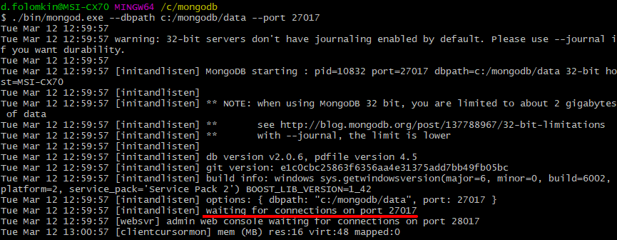

# ЛР-1 Разработка БД на MongoDB. CRUD-операции с данными в MongoDB

### Цель работы

Познакомиться с постреляционной БД MongoDB и ее основными возможностями.

Научиться работать с основными утилитами MongoDB - mongod, mongo, mongoexport, mongoimport и др.

Научиться выполнять добавление, чтение, обновление и удаление данных (CRUD-операции).

### Потребуется ПО

- [MongoDB](https://www.mongodb.com/download-center/community)

- командная оболочка системы (cmd, PowerShell, git bash)

TODO: добавить работу с графической оболочкой MongoDB Compass.

- [MongoDB Compass](https://www.mongodb.com/products/compass)

### Быстрый переход

- [1 Установка MongoDB](#-1-Установка-MongoDB)

- [2 Запуск сервера](#-2-Запуск-сервера)

- [3 Работа с БД](#-3-Работа-с-БД)

- [3.1 Запуск mongo shell](#-3.1-Запуск-mongo-shell)

- [3.2 Операции с БД](#-3.2-Операции-с-БД)

- [3.3 Операции с коллекциями](#-3.3-Операции-с-коллекциями)

- [3.4 Операции CRUD с документами](#-Операции-CRUD-с-документами)

- [3.4.1 Insert (C in CRUD)](<#-3.4.1-Insert-(C-in-CRUD)>)

- [3.4.2 Find (R in CRUD)](<#-3.4.1-Find-(R-in-CRUD)>)

- [3.4.3 Update (U in CRUD)](<#-3.4.3-Update-(U-in-CRUD)>)

- [3.4.4 Delete (D in CRUD)](<#-3.4.4-Delete-(D-in-CRUD)>)

- [3.5 Экспорт данных](#-3.5-Экспорт-данных)

- [3.6 Импорт данных](#-3.6-Импорт-данных)

- [3.7 Резервное копирование данных](#-3.7-Резервное-копирование-данных)

- [3.8 Восстановление данных из резервной копии](#-3.8-Восстановление-данных-из-резервной-копии)

- [Практическая часть](#-Практическая-часть)

- [Материалы для самостоятельного изучения](#-Материалы-для-самостоятельного-изучения)

## Теоретическая часть

MongoDB - документоориентированная система управления базами данных (СУБД) с открытым исходным кодом, не требующая описания схемы таблиц. Классифицирована как NoSQL, использует JSON-подобные документы и схему базы данных. Написана на языке C++. ([wiki](https://ru.wikipedia.org/wiki/MongoDB))

### 1 Установка MongoDB

Существуют различные варианты установки MongoDB:

- с помощью .msi-пакета установщика Windows (можно установить как сервис);

- с помощью zip-архива с файлами MongoDB;

- с помощью Docker-контейнера.

Будем использовать 2-ой способ.

[Загрузите](https://www.mongodb.com/download-center/community) zip-архив (выберите тип package - zip) и распакуйте содержимое, например, в `c:\mongodb`:


Если у вас Windows XP x32 (мои соболезнования), скачать необходимое ПО можно [отсюда](https://drive.google.com/open?id=1gd7yMW8-Z6F-0Kvs_Vhvox2KojGK78FD).

Утилиты MongoDB представлены в виде отдельных .exe-файлов и расположены в `c:\mongodb\bin`:


- **mongo**: представляет консольный интерфейс для взаимодействия с базами данных, своего рода консольный клиент

- **mongod**: сервер баз данных MongoDB. Он обрабатывает запросы, управляет форматом данных и выполняет различные операции в фоновом режиме по управлению базами данных

- **mongodump**: утилита создания бэкапа баз данных

- **mongoexport**: утилита для экспорта данных в форматы JSON, TSV или CSV

- **mongoimport**: утилита, импортирующая данных в форматах JSON, TSV или CSV в БД MongoDB

- **mongorestore**: позволяет записывать данные из дампа, созданного **mongodump**, в новую или существующую БД

- **mongorestat**: представляет счетчики операций с БД

Работа с утилитами осуществляется с помощью командной оболочки / консоли (cmd, PowerShell, git bash).

### 2 Запуск сервера

**mongod** - сервер баз данных MongoDB. Обрабатывает запросы и выполняет в фоновом режиме различные операции по управлению БД.

Для запуска введите следующие команды:

`cd c:/mongodb` - здесь и далее будем считать это корневой папкой для относительных путей

`mkdir data` - создайте папку для хранения данных

```
> ./bin/mongod --dbpath c:/mongodb/data --port 27017
```

где

`--dbpath` - путь до БД

`--port` - выделяемый для сервера порт

В консоли появятся служебные сообщения:



`[initandlisten] waiting for connections on port 27017` информирует нас о том, что сервер запустился и ожидает подключений на указанный порт.

Для выхода из режима ожидания и остановки сервера в консоли нажмите **ctrl + с**.

Сервер будет доступен по адресу `//localhost:27017`. Помним, что `localhost` соответствует ip `127.0.0.1`.

### 3 Работа с БД

**mongo** - консольный интерфейс для взаимодействия с БД.

#### 3.1 Запуск mongo shell

Для запуска введите следующие команды в **новой** консоли (т.е. у вас должно быть одновременно запущено два процесса: сервер и клиент):

```
> ./bin/mongo --host localhost
```

По-умолчанию интерфейс будет подключаться к порту 27017. Если при запуске сервера был указан другой порт, то явно укажите его:

```
> ./bin/mongo --host localhost --port 27017
```

где

`--host` - ip-адрес сервера

`--port` - порт сервера

Запустится режим **интерактивной оболочки (mongo shell)** и можно будет вводить команды для взаимодействия с БД:


Для выхода из режима интерактивной оболочки в консоли нажмите **ctrl + с**.

В консоли сервера тем временем появится сообщение `[initandlisten] connection accepted from 127.0.0.1:51337 #1`.

#### 3.2 Операции с БД

`show dbs` - вывод списка доступных БД

```
> show dbs
local (empty)
```

`use [dbname]` - создание новой БД или выбор существующей c именем [dbname] (одна и та же команда)

```
> use [dbname]
 switched to db [dbname]
```

До создания вашей первой БД активной является тестовая с `[dbname]=test`.

Для сохранения БД необходимо добавить хотя бы одну коллекцию (см. далее).

`db` - вывод имени текущей БД

```
> db
[dbname]
```

`db.stats()` - вывод статистики использования текущей БД в формате

```
> db.stats()
{
  "db" : "[dbname]",
  "collections" : 0,
  "objects" : 0,
  "avgObjSize" : 0,
  "dataSize" : 0,
  "storageSize" : 0,
  "numExtents" : 0,
  "indexes" : 0,
  "indexSize" : 0,
  "fileSize" : 0,
  "nsSizeMB" : 0,
  "ok" : 1
}

```

`db.dropDatabase()` - удаление **текущей** БД

```
> db.dropDatabase()
{ "dropped" : [dbname], "ok" : 1 }
```

Можно удалить тестовую БД с `[dbname]=test`.

Соответствующий раздел официальной документации ([link](https://docs.mongodb.com/manual/reference/mongo-shell/))

#### 3.3 Операции с коллекциями

В MongoDB БД сущности предметной области представлены **коллекциями** подобно тому, как в реляционной БД существуют таблицы.

Экземпляры коллекций - **документы** - подобны записям в таблицах реляционной БД. Однако документы одной коллекции могут иметь абсолютно разную структуру. Это предоставляет определенную гибкость при моделировании данных.

Каждая коллекция имеет свое уникальное имя.

`db.createCollection([colname])` - создание коллекции с именем '[colname]' (в апострофах)

```
> db.createCollection([colname])
{ "ok" : 1 }
```

`db.[colname]` - доступ к созданной коллекции

`show collections` - вывод списка коллекций в текущей БД

```
> show collections
[colname1]
[colname2]
...
system.indexes
```

`db.[colname].drop()` - удаление коллекции [colname]

```
> db.[colname].drop()
true
```

Соответствующий раздел официальной документации ([link](https://docs.mongodb.com/manual/reference/mongo-shell/))

#### 3.4 Операции CRUD с документами

CRUD - аббревиатура, составленная из первых букв названий простейших операций с данными: Create, Read, Update, Delete.

Все операции CRUD в MongoDB представляют собой методы определенной коллекции, т.е. db.[colname].[operationname|().

Помним, что MongoDB является документоориентированной системой, в которой центральным понятием является **документ**.

Документ можно представить как объект, хранящий некоторую информацию. В MongoDB документ представлен в формате BSON (Binary JavaScript Object Notation):

```
{
  "name": "Wine - Crozes Hermitage E.",
  "manufacturer": {
    "name": "Yodoo",
    "country": "Paraguay"
  },
  "date_of_manufacture": "2018-07-22",
  "weight": 1.47,
  "nutritional_value": {
    "protein": 24.7,
    "fat": 63.2,
    "carbohydrates": 31.9
  }
}
```

MongoDB не ограничивает уровень вложенности в документах.

##### 3.4.1 Insert (C in CRUD)

[ ^3.2 ] `db.[colname].insertOne({ [fieldname]: [value], ...})` - добавление одной записи

- [ ^3.2 ] - впервые появилось только в версии 3.2.

```
> db.[colname].insert({ [fieldname]: [value], ... })
WriteResult({ "nInserted" : 1 })
```

[ ^3.2 ] `db.[colname].insertMany([{ [fieldname]: [value], ...}, ...])` - добавление нескольких записей

```
> db.[colname].insertMany([{ [fieldname]: [value], ...}, ...])
{
  "acknowledged" : true,
  "insertedId" : ObjectId("59da1f0e7beae71eb19dd1b2")
}
```

`db.[colname].insert({ [fieldname]: [value], ...})` - добавление одной или нескольких записей

```
> db.[colname].insert({ [fieldname]: [value], ...})
{
  "acknowledged" : true,
  "insertedIds" : [
    ObjectId("59da1f7e7beae71eb19dd1b3"),
    ObjectId("59da1f7e7beae71eb19dd1b4")
  ]
}
```

Все методы могут принимать в качестве второго опционального параметра объект опций, например, для добавления с задержкой.

`mongo shell` допускает ввод команды построчно. Это удобно для больших вложенных объектов.

`insertOne()` и `insertMany()` возвращают идентификаторы созданных записей.

**Уникальный идентификатор**

Для каждого документа в MongoDB определен **уникальный идентификатор**, который называется **\_id**. При добавлении документа в коллекцию данный идентификатор создается автоматически. Однако разработчик может сам явным образом задать идентификатор, а не полагаться на автоматически генерируемые, указав соответствующий ключ и его значение в документе.

Данное поле должно иметь уникальное значение в рамках коллекции. И если мы попробуем добавить в коллекцию два документа с одинаковым идентификатором, то добавится только один из них, а при добавлении второго мы получим ошибку.

Соответствующий раздел официальной документации ([link](https://docs.mongodb.com/manual/reference/insert-methods/))

##### 3.4.1 Find (R in CRUD)

`db.[colname].find()` - вывод всех документов коллекции (пустой критерий поиска)

`db.[colname].find().pretty()` - добавление `.pretty()` после позволяет вывести документы в многострочном виде, лучше отображающем структуру

`db.[colname].find({ [fieldname]: [criteria], ... })` - вывод документов коллекции, которые попадают под критерии поиска, задаваемые объектом

```
> db.[colname].find({ [fieldname]: [criteria], ... })
{ "_id" : ObjectId("..."), ... }
```

В объекте-критерии используются различные специальные операторы для расширения возможностей поиска.

`db.[colname].find({ [fieldname]: {[operator]: [value]}, ... })`

**Условные операторы**

Условные операторы задают условие, которому должно соответствовать значение поля документа:

- `$eq` - равно (можно просто указать значение поля)

- `$ne` - не равно

- `$gt` - больше чем

- `$lt` - меньше чем

- `$gte` - больше или равно

- `$lte` - меньше или равно

- `$in` - определяет массив значений, одно из которых должно иметь поле документа (можно просто указать массив значений для поля)

- `$nin` - определяет массив значений, которые не должно иметь поле документа

Например, `db.goods.find({ name: "apple", price: { $lte: 5 } })` - вывести все товары с именем `apple` и ценой меньшей или равной `5`.

**Логические операторы**

Логические операторы выполняются над условиями выборки:

- `$and` - соединяет два условия, и документ должен соответствовать обоим условиям (обычно используется для соединения условий для одного поля, т.к. для разных полей можно обойтись и без оператора)

- `$or` - соединяет два условия, и документ должен соответствовать одному из этих условий

- `$not` - документ должен НЕ соответствовать условию

- `$nor` - соединяет два условия, и документ должен НЕ соответствовать обоим условиям

Например, `db.goods.find({ $and: [{ price: { $lt: 5 } }, { price: { $ne: 1.99 } }] })` - вывести все товары, с ценой меньшей `5`, но не равной `1.99`.

**Прочие операторы**

- `$exist` - позволяет вывести только те документы, в которых определенный ключ присутствует или отсутствует

`db.[colname].find({ [fieldname]: { $exists: true } })`

**Проекция**

Проекция позволяет ограничить количество выводимых в консоль полей в выборке.

Например, `db.goods.find({ name: "apple" }, { price: 1 })` - найти все товары с именем `apple` и вывести только их цену.

**Методы группировки**

Результат выборки называется **курсором**. К нему можно применять методы группировки.

- `count()` - вывести количество элементов выборки

`db.[colname].find().count()`

`db.[colname].count()` - `count()` можно применять и непосредственно к коллекции

- `limit(n)` - ограничить выборку `n` элементами

- `skip(n)` - при выборке пропустить первые `n` элементов

- `sort({ [fieldname]: [1/-1] })` - отсортировать результат выборки (`1` - по возрастанию соответствующего поля, `-1` - по убыванию)

Например, `db.goods.find().sort({ name: 1 })` - вывести все товары и отсортировать их по имени

TODO: distinct() можно применять к курсору?

Соответствующий раздел официальной документации ([link](https://docs.mongodb.com/manual/tutorial/query-documents/))

##### 3.4.3 Update (U in CRUD)

[ ^3.2 ] `db.[colname].updateOne({ [fieldname]: [criteria], ... }, { $set: { ... } })` - обновление первого документа из всех, соответствующих критерию, данными, представленными в `$set`

```
> db.[colname].updateOne({ [fieldname]: [criteria], ... }, { $set: { ... } })
{ "acknowledged" : true, "matchedCount" : 1, "modifiedCount" : 1 }
```

[ ^3.2 ] `db.[colname].updateMany({ [fieldname]: [criteria], ... }, { $set: { ... } })` - обновление всех документов, соответствующих критерию, данными, представленными в `$set`

```
> db.[colname].updateMany({ [fieldname]: [criteria], ... }, { $set: { ... } })
{ "acknowledged" : true, "matchedCount" : [n], "modifiedCount" : [m] }
```

`db.[colname].update({ [fieldname]: [criteria], ... }, { $set: { ... } })` - обновление первого документа или всех документов из выборки по критерию данными, представленными в `$set`

Все вышеперечисленные методы могут принимать в качестве третьего опционального параметра объект опций, наиболее важными из которых являются:

- `multi: true` (только для `.update()`) - мульти-обновление всех документов, аналог `.updateMany()`. По-умолчанию `false`.

- `upsert: true` (`update + insert`) - если ни один документ не соответствует критерию, то добавляется новый. По-умолчанию `false`.

Например, `db.goods.update({ name: "apple" }, { $set: { weight: 100 } })` - найти первый товар с именем `apple`и заменить его вес на `100` (остальные поля оставить без изменения).

В то время, как `db.goods.update({ name: "apple" }, { $set: { weight: 100 } }, { multi: true })` - заменит вес у всех `apple`.

Все вышеперечисленные методы позволяют частично обновлять документ/ты.

Для полной замены документа используется `db.[colname].replaceOne{ [fieldname]: [criteria], ... }, { ... })`.

```
> db.[colname].replaceOne{ [fieldname]: [criteria], ... }, { ... })
{ "acknowledged" : true, "matchedCount" : 1, "modifiedCount" : 1 }
```

Мульти-версия отсутствует.

TODO: описать группу .findOneAnd...()

Соответствующий раздел официальной документации ([link](https://docs.mongodb.com/manual/tutorial/update-documents/))

##### 3.4.4 Delete (D in CRUD)

[ ^3.2 ] `db.[colname].deleteOne({ [fieldname]: [criteria], ... })` - удаление первого документа из всех, соответствующих критерию

```
> db.[colname].deleteOne({ [fieldname]: [criteria], ... })
{ "acknowledged" : true, "deletedCount" : 1 }
```

[ ^3.2 ] `db.[colname].deleteMany({ [fieldname]: [criteria], ... })` - удаление всех документов, соответствующих критерию

```
> db.[colname].deleteMany({ [fieldname]: [criteria], ... })
{ "acknowledged" : true, "deletedCount" : [n] }
```

`db.[colname].remove({ [fieldname]: [criteria], ... })` - удаление первого документа или всех документов из выборки по критерию, что устанавливается в опциях (`justOne: true`)

Соответствующий раздел официальной документации ([link](https://docs.mongodb.com/manual/tutorial/remove-documents/))

#### 3.5 Экспорт данных

Для экспорта коллекции в .json-файл используется утилита `mongoexport`.

Не забудьте завершить работу с `mongo shell` с помощью **ctrl + c**.

```
> cd c:/mongodb
> ./bin/mongoexport --db [dbname] --collection [colname] --out c:/mongodb/[collection].json
connected to: 127.0.0.1
exported [n] records
```

Соответствующий раздел официальной документации ([link](https://docs.mongodb.com/manual/reference/program/mongoexport/))

#### 3.6 Импорт данных

Для импорта .json-файла в коллекцию используется утилита `mongoimport`.

```
> cd c:/mongodb
> ./bin/mongoimport --db [dbname] --collection [colname] --jsonArray c:/mongodb/[collection].json
connected to: 127.0.0.1
imported [n] records
```

Соответствующий раздел официальной документации ([link](https://docs.mongodb.com/manual/reference/program/mongoimport/))

#### 3.7 Резервное копирование данных

Для создания резервной копии используется утилита `mongodump`.

```
> ./bin/mongodump --db [dbname] --out c:/mongodb/backup
```

Соответствующий раздел официальной документации ([link](https://docs.mongodb.com/manual/reference/program/mongodump/))

#### 3.8 Восстановление данных из резервной копии

Для восстановления данных используется утилита `mongorestore`.

```
> ./bin/mongorestore --db [dbname] --drop c:/mongodb/backup/[dbname]
```

Соответствующий раздел официальной документации ([link](https://docs.mongodb.com/manual/reference/program/mongorestore/))

**Создание JSON-файла**

Создать .json-файл можно в любом редакторе кода.

Для этого необходимо:

- создать новый файл,

- записать в него структуру, подобно этому [примеру](./example.json),

- сохранить файл в формате [filename].json

Многие редакторы (например, [VSCode](https://code.visualstudio.com/download)) имеют авто-форматирование при сохранении, что позволит автоматически правильно "выстроить" структуру JSON.

Можно использовать генератор [mockaroo.com](https://mockaroo.com/) (не для всех предметных областей подойдет).

How to generated nested JSON objects and arrays in Mockaroo [youtube](https://www.youtube.com/watch?v=YIm3Xx1jk3g)

## Практическая часть

### Варианты предметной области

TODO: зафиксировать варианты в таблице студентов!

- Библиотека (коллекции: Книги, Жанры, Статусы книг, Читатели)

- Больница (коллекции: Врачи, Специальности, Расписание работы, Пациенты, Записи на прием)

- Аптека (коллекции: Лекарственные средства, Категории, Производители, Ячейки хранения)

- Склад (коллекции: Товары, Поставщики, Складские ячейки, Накладные)

- Интернет-провайдер (коллекции: Тарифы, Абоненты, Оборудование, Оплата, Заявки в поддержку)

- Автосервис (коллекции: Услуги, Запчасти, Клиенты, Заявки на обслуживание)

- Ремонт квартир (коллекции: Услуги, Клиенты, Мастера, Заявки на ремонт)

- Интернет-магазин (коллекции: Товары, Категории, Клинеты, Заказы, Способы оплаты/доставки)

### Порядок выполнения

1. Удалить БД test.

2. Создать новую БД.

3. Создать коллекции согласно своему варианту.

4. Заполнить коллекции данными.

5. Создать .json-файлы с несколькими документами для своих коллекций и импортировать их в БД.

6. Отработать различные варианты поиска (6-8 операций).

7. Обновить некоторые документы по различным критериям (6-8 операций).

8. Удалить некоторые документы по различным критериям (3-5 операций).

9. Экспортировать коллекции в .json-файлы.

### Содержание отчета

Результаты выполнения каждого пункта, обозначенного выше, необходимо зафиксировать в виде скриншотов или текста.

Бланк отчета можно скачать [здесь](https://drive.google.com/open?id=1KEywxfilq9Fesg5whqvmXiS2NeAINn0x).

### Вопросы для самоконтроля

1. Определение MongoDB. Тип БД.

2. Преимущества и недостатки MongoDB как NoSQL БД.

3. Структурные элементы в MongoDB.

4. Формат JSON / BSON.

5. Способы запуска и работы с MongoDB. Основные утилиты.

6. Основные операции с БД.

7. Основные операции с коллекциями.

8. Возможности выборки документов (find).

9. Утилиты для импорта / экспорта данных.

## Материалы для самостоятельного изучения

### Официальная документация

- [MondoDB](https://docs.mongodb.com/manual/mongo/)

- [MongoDB Compass](https://docs.mongodb.com/compass/current/)

### Руководства, статьи

- Руководство MongoDB ([metanit](https://metanit.com/nosql/mongodb/))

- Поработаем с MongoDB ([habr](https://habr.com/ru/post/127290/))

- MySQL и MongoDB - когда и что лучше использовать ([habr](https://habr.com/ru/post/322532/))

- Install, setup and start MongoDB on Windows ([link](https://blog.ajduke.in/2013/04/10/install-setup-and-start-mongodb-on-windows/))

- Курс по MongoDB. Урок 1. Установка MongoDB ([видео](https://www.youtube.com/watch?v=TIH3dcZjrzk))

- Курс по MongoDB. Урок 2. Подключение к базе ([видео](https://www.youtube.com/watch?v=hTtGQh4qNxY))

- MongoDB вводная лекция ([видео](https://www.youtube.com/watch?v=tgckAOyjXPI))

## Контактная информация

Если вы

- заметили какую-либо ошибку (в т.ч. орфографическую),

- столкнулись с тем, что что-то работает не так, как здесь описано, или не работает вообще,

пожалуйста, напишите об этом на (d.folomkin@yandex.ru).
